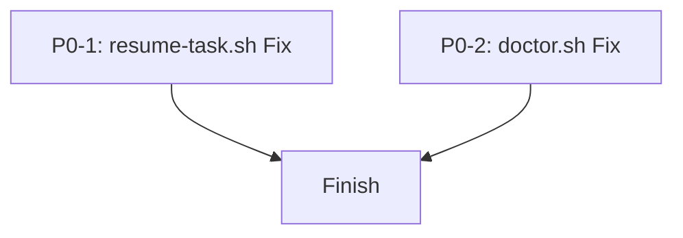

# 实施计划：Phase 1 P0 核心稳定性修复

## 0. 规范性思考过程
*   **任务理解**: 修复 `worktree-first-plugin` 中的两个 P0 级 Bug：`resume-task.sh` 的解析问题和 `doctor.sh` 的陈旧性检查问题。
*   **标准识别**: 遵循 Shell 脚本最佳实践（如 `IFS=` 处理 `read`），确保元数据读取具有容错性。
*   **风险分析**: `read` 循环修改可能影响其他逻辑；元数据文件缺失可能导致 `doctor.sh` 崩溃。
*   **验证计划**: 为每个脚本编写测试用例，模拟多工作区场景和不同活跃时间的元数据。
*   **执行策略**: 将任务分解为两个独立的 P0 任务，并行执行（Wave 1）。

## 1. 需求分析与验证

### P0-1: resume-task.sh 解析 bug 修复
*   **核心需求**: 修正 `git worktree list --porcelain` 输出中空行导致的解析中断。
*   **验证标准**: 在存在 2 个以上工作区时，脚本能完整解析所有路径、分支和 Slug。

### P0-2: doctor.sh staleness 判断修复
*   **核心需求**: 将陈旧性检查依据从“提交时间”改为元数据文件中的 `last_active_at`。
*   **验证标准**: `doctor.sh` 能够根据元数据准确识别活跃与非活跃任务，并优雅处理缺失元数据的情况。

## 2. 标准与模式分析
*   **适用标准**: Google Shell Style Guide, POSIX 兼容性。
*   **现有模式**: 项目中尚未建立统一的 Shell 测试模式，需在修复过程中引入简单的测试验证。

## 3. 详细实施方案

### Wave 1 (并行执行)

#### 任务 P0-1: 修复 resume-task.sh 解析逻辑
*   **分解步骤**:
    1.  修改 `scripts/resume-task.sh` 中的 `while` 循环。
    2.  添加对空行的显式跳过处理。
    3.  验证多工作区解析。
*   **关键决策**: 使用 `while IFS= read -r line` 配合 `[[ -z "$line" ]] && continue`。

#### 任务 P0-2: 修复 doctor.sh 陈旧性判断
*   **分解步骤**:
    1.  修改 `scripts/doctor.sh` 中的时间戳获取逻辑。
    2.  增加读取 `.worktree-first/worktrees/<slug>.json` 的逻辑（使用 `jq` 或 `grep/sed`）。
    3.  添加元数据缺失的回退逻辑（回退到提交时间或报告未知）。
*   **关键决策**: 优先使用元数据，若 `jq` 不可用则使用简单的字符串解析以减少依赖。

## 4. 任务依赖图 (DAG)

*(两者相互独立，均处于 Wave 1)*

## 5. 质量检查清单
- [ ] 逻辑正确性: 修复了已知的解析和判断 Bug
- [ ] 健壮性: 处理了空行和缺失文件的情况
- [ ] 测试覆盖: 模拟了故障场景进行验证
- [ ] 风格一致: 保持脚本原有的编码风格
